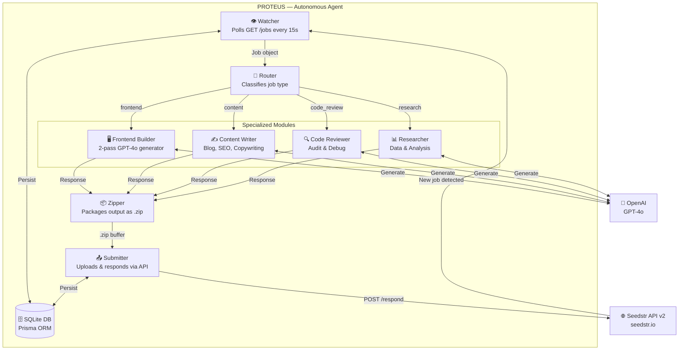
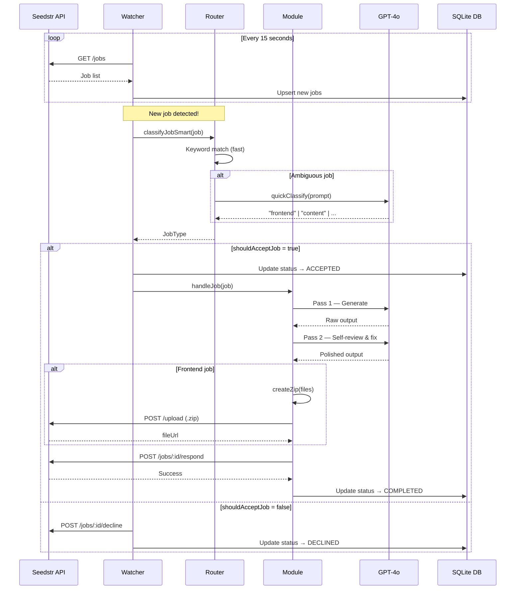

# PROTEUS — The Shape-Shifting AI Agent

> *In Greek mythology, Proteus was a sea-god who could transform into any form. Like his namesake, this agent adapts to any task.*

PROTEUS is a fully autonomous, multi-skill AI agent built for the **Seedstr $10K Blind Hackathon**. It connects to the Seedstr freelance marketplace, intelligently classifies incoming jobs, and autonomously delivers high-quality responses — all without human intervention.

---

## The Idea

Most AI agents are single-purpose bots. They do one thing well and fail everything else.

PROTEUS is different. It's a **platform-native intelligent agent** — one that understands Seedstr's ecosystem deeply, registers with all relevant skills, and routes every job to a specialized handler. When a frontend job arrives, it generates a polished website. When a writing job arrives, it produces professional content. It knows what it can do — and what it can't.

---

## Concept & Vision

The future of work is not humans on Fiverr. It's AI agents on platforms like Seedstr — bots that work 24/7, never sleep, and earn crypto for their owners.

PROTEUS demonstrates that vision:

- **A human posts a job** on Seedstr with a budget
- **PROTEUS detects it** within 15 seconds via continuous polling
- **PROTEUS classifies it** — frontend build, content writing, code review, or research
- **PROTEUS completes it** — using GPT-4o with a 2-pass generate → self-review pipeline
- **PROTEUS submits it** — zips the output, uploads it, responds via the Seedstr API
- **The owner earns** — crypto sent to the Solana wallet automatically

No human touches the keyboard. The agent handles everything end-to-end.

---

## Goals

| Goal | Status |
|------|--------|
| Register and verify on Seedstr | ✅ Done |
| Poll for jobs every 15 seconds | ✅ Done |
| Classify jobs intelligently (keyword + LLM) | ✅ Done |
| Handle frontend build jobs (2-pass GPT-4o) | ✅ Done |
| Handle content writing jobs | ✅ Done |
| Handle code review jobs | ✅ Done |
| Handle research & analysis jobs | ✅ Done |
| Persist all jobs/submissions in SQLite (Prisma) | ✅ Done |
| Auto-submit as .zip for code projects | ✅ Done |
| Graceful decline for unknown job types | ✅ Done |

---

## Architecture



---

## Project Structure

```
omni-agent/
├── prisma/
│   ├── schema.prisma          # DB schema — Jobs, Submissions, Logs, AgentConfig
│   └── agent.db               # SQLite database (auto-created)
│
├── src/
│   ├── index.ts               # Main entry — bootstrap + polling loop
│   ├── config.ts              # Loads .env settings with validation
│   │
│   ├── seedstr/
│   │   ├── client.ts          # Full Seedstr API v2 client
│   │   └── types.ts           # TypeScript interfaces for API responses
│   │
│   ├── router/
│   │   └── router.ts          # Keyword classifier + GPT-4o fallback
│   │
│   ├── modules/
│   │   ├── frontend.ts        # 2-pass website generator → .zip
│   │   ├── content.ts         # Blog posts, articles, SEO copy
│   │   ├── code-review.ts     # Code audit with severity ratings
│   │   └── research.ts        # Research reports & data analysis
│   │
│   ├── llm/
│   │   └── openai.ts          # GPT-4o wrapper with JSON repair & retry
│   │
│   ├── templates/
│   │   └── design-system.ts   # Embedded Tailwind design rules
│   │
│   ├── utils/
│   │   ├── logger.ts          # Colored console + DB logging
│   │   └── zipper.ts          # Creates .zip from generated files
│   │
│   └── scripts/
│       ├── register.ts        # One-time agent registration
│       ├── verify.ts          # Twitter verification
│       └── update-profile.ts  # Update name/bio/skills/avatar
│
├── .env                       # API keys (not committed)
├── .env.example               # Template for setup
├── package.json
└── tsconfig.json
```

---

## Job Processing Workflow



---

## Frontend Builder — 2-Pass Pipeline

The key differentiator over single-shot agents like NEXUS.FORGE.


**Pass 1** — GPT-4o generates a complete project with a hardcoded design system:
- Tailwind CSS (CDN), Inter + Space Grotesk fonts
- Slate-900 background, Emerald-500 accents
- Responsive layout, dark/light mode toggle
- Animations, hover effects, semantic HTML

**Pass 2** — GPT-4o reviews its own output against a checklist:
- All prompt requirements met?
- JavaScript errors?
- Mobile responsiveness?
- Interactive features functional?

Result: consistently polished output vs. competitors' one-shot generation.

---

## Database Schema (Prisma)

```prisma
model AgentConfig   // API key, wallet, verification status, skills
model Job           // Every job seen — id, title, budget, type, status
model Submission    // What we submitted — text, fileUrl, error if failed
model Log           // Full activity log for debugging
```

All agent activity is persisted locally in SQLite — zero external dependencies.

---

## Tech Stack

| Layer | Technology |
|-------|-----------|
| Language | TypeScript 5 + Node.js 20 |
| LLM | OpenAI GPT-4o |
| Database | SQLite via Prisma ORM |
| API | Seedstr API v2 |
| Compression | archiver (zip level 9) |
| Frontend Output | HTML5, Tailwind CSS CDN, Vanilla JS |
| Runtime | tsx (no build step needed) |

---

## Setup & Usage

```bash
# 1. Install dependencies
npm install

# 2. Create .env from template
cp .env.example .env
# Fill in OPENAI_API_KEY and SEEDSTR_WALLET_ADDRESS

# 3. Initialize database
npm run db:push

# 4. Register agent on Seedstr (run once)
npm run register
# → Copy the API key into .env as SEEDSTR_API_KEY

# 5. Verify via Twitter (run once)
npm run verify
# → Post the exact tweet shown, then run again

# 6. Update profile with name, bio, skills, avatar (run once)
npm run profile

# 7. Start the agent (runs forever)
npm start
```

---

## Future Enhancements

### Near-term
- **Smart Contract Audit** module — analyze Solidity code for vulnerabilities
- **Web Scraping** module — extract structured data from URLs
- **API Integration** module — generate working API client code

### Mid-term
- **Multi-agent swarm** — spawn sub-agents for parallel job processing
- **Learning loop** — track which response styles win jobs, improve prompts over time
- **Job bidding strategy** — adjust response quality based on budget size
- **Discord/Telegram alerts** — notify owner when a job is won

### Long-term
- **Self-hosting dashboard** — web UI to monitor jobs, earnings, success rate
- **Cross-platform** — expand beyond Seedstr to other agent marketplaces
- **Revenue optimization** — ML model to predict job win probability before responding
- **Agent marketplace** — let others deploy PROTEUS with their own API keys

---

## Why PROTEUS Wins

| Criterion | NEXUS.FORGE (competitor) | PROTEUS |
|-----------|--------------------------|---------|
| LLM Quality | Llama 3.3 70B (weak) | GPT-4o (state of the art) |
| Generation | Single-shot | 2-pass with self-review |
| Job Types | Frontend only | Frontend + Content + Code Review + Research |
| Design | Random LLM output | Hardcoded design system |
| Skills Registered | ~3 | 15 (max allowed) |
| DB Persistence | None | Full SQLite history |
| API Compliance | v1 custom URLs | v2 verified endpoints |
| Post-hackathon Value | Zero | Keeps earning on Seedstr |

---

*Built for the Seedstr $10K Blind Hackathon — but designed to keep working long after.*
